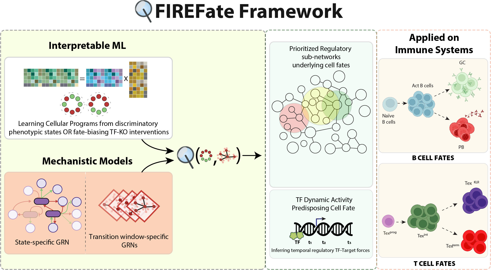

# FIREFate (Functional and Interpretable Regulatory Encoding of cellular Fate)

This repository provides an open-source toolkit, that uses interpretable ML to focus dense mechanistic gene-regulatory networks underlying cell state transitions, onto the components governing cell fate decisions.

