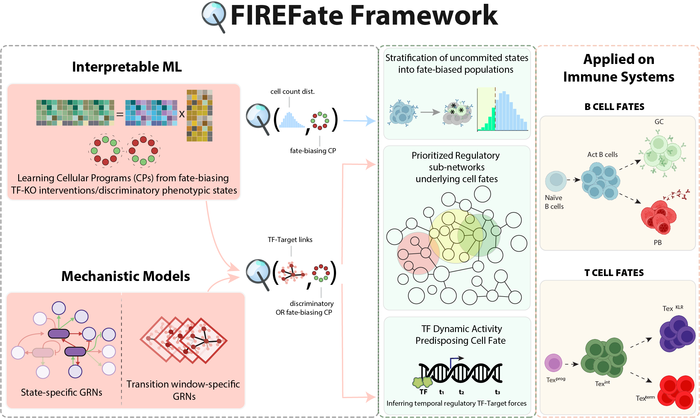

This repository provides an open-source toolkit, which delivers multi-scale insights at the cell-population, gene-regulatory and epigenomic levels to predict fate-bias during cell state transitions, and infer regulatory components governing cell fate decisions. The framework is built for single-cell (sc-snRNA/scATAC-seq) datasets for both matched or un-matched multi-omic sequenced populations.



Downstream tasks include - 

1. Discovery of interpretable cellular programs (CPs) underlying phenotypically-contrasting cell states, arising from natural progression of cellular processes or fate-biasing interventions.

2. Prediction of fate-biased cell populations in uncommitted states during differentiation, using CPs inferred from intervention datasets (TF-KO)

3. Construction of State-Specific GRNs, and a combined cross-state GRN whose connectivity spans both states in (1), for enrichment of Transcription Factor (TF) activity, which regulates the CP encoding the discriminative phenotype between states.

4. Construction of Transition-Window-Specific GRNs, with clustered regulatory edges to temporally order waves of TF regulation.

5. Construction of Episodic GRNs that capture TF–target forces held temporally invariant across each episode, for enrichment of dynamic TF epigenomic and regulatory activity within each CP, underlying cell fate.

6. Quantification of in-silico perturbation effects from state-specific (DONE) /dynamic phenotypic shifts (TO-DO) induced by perturbing enriched TFs.

## Notebooks

The analysis notebooks live in a companion repository,
[**firefate_notebooks**](https://github.com/sachha-naksha/firefate_notebooks), and are
pulled in here as a git submodule at `docs/notebooks` so the documentation can render
them. Clone with them:

```bash
git clone --recurse-submodules https://github.com/sachha-naksha/FIREFate
```

If you already cloned without them:

```bash
git submodule update --init docs/notebooks
```

The submodule is optional — the package installs and the API docs build without it.

## Documentation

User guide, API reference and the rendered notebooks are built with Sphinx and hosted on
**Read the Docs**. The build is configured by `.readthedocs.yml`, which also tells Read the Docs to
check out the `docs/notebooks` submodule. Point a project at this repository at
[readthedocs.org](https://readthedocs.org/); with the slug `firefate` the site lands at
[https://firefate.readthedocs.io/](https://firefate.readthedocs.io/).

To build the HTML docs locally:

```bash
git submodule update --init docs/notebooks   # optional; without it the API docs still build
pip install ".[docs]"
sphinx-build -b html docs docs/_build/html
```

Notebooks are rendered from their stored outputs and are never executed
(`nb_execution_mode = "off"`), so the build needs no data and no GPU.
