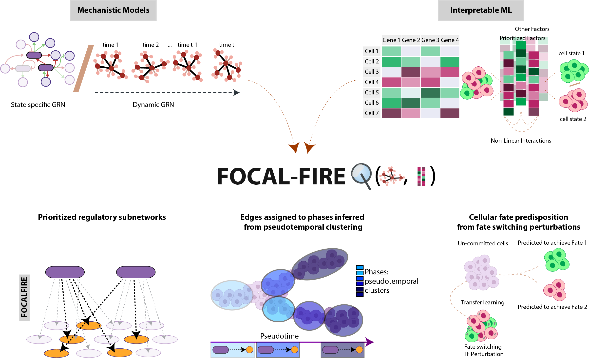

# FocalFire

**FocalFire** (Functional and Interpretable Regulatory Encoding of cellular Fate) is an open-source toolkit that combines mechanistic gene regulatory networks (GRNs) with interpretable machine learning to focus dense state-specific and dynamic GRNs onto the regulatory components that govern cell fate decisions. It works on single-cell RNA and ATAC data (sc/snRNA-seq, scATAC-seq), matched or unmatched.



What it does:

- **Prioritized regulatory subnetworks.** Interpretable ML discovers sparse cellular programs (CPs) that separate contrasting cell states, and embeds them in state-specific and cross-state GRNs to surface the transcription factors (TFs) whose regulons are enriched for each program, including in-silico perturbation of the enriched TFs.
- **Phase-resolved dynamic regulation.** Transition-window and episodic GRNs along pseudotime assign TF–target edges to regulatory phases inferred from pseudotemporal clustering, ordering waves of TF regulation and retaining the forces that stay invariant within each episode.
- **Fate predisposition by transfer learning.** CPs learned from fate-switching perturbations (e.g. TF knockouts) versus controls stratify uncommitted populations in unperturbed data by their predicted fate bias.

The full description of all capabilities, the methods, the user and developer API, and the rendered analysis notebooks are on Read the Docs: **[focalfire.readthedocs.io](https://focalfire.readthedocs.io/)**.

## Notebooks

The analysis notebooks live in a companion repository,
[**firefate_notebooks**](https://github.com/sachha-naksha/firefate_notebooks), and are
pulled in here as a git submodule at `docs/notebooks` so the documentation can render
them. Clone with them:

```bash
git clone --recurse-submodules https://github.com/sachha-naksha/FIREFate
```

If you already cloned without them:

```bash
git submodule update --init docs/notebooks
```

The submodule is optional — the package installs and the API docs build without it.

## Documentation

User guide, API reference and the rendered notebooks are built with Sphinx and hosted on
**Read the Docs**. The build is configured by `.readthedocs.yml`, which also tells Read the Docs to
check out the `docs/notebooks` submodule. Point a project at this repository at
[readthedocs.org](https://readthedocs.org/); with the slug `firefate` the site lands at
[https://firefate.readthedocs.io/](https://firefate.readthedocs.io/).

To build the HTML docs locally:

```bash
git submodule update --init docs/notebooks   # optional; without it the API docs still build
pip install ".[docs]"
sphinx-build -b html docs docs/_build/html
```

Notebooks are rendered from their stored outputs and are never executed
(`nb_execution_mode = "off"`), so the build needs no data and no GPU.
